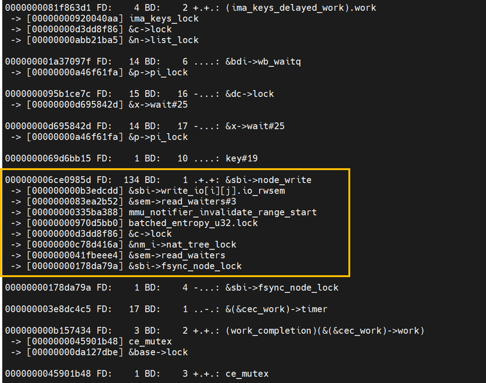

# GPU Programming (Programming Massively Parallel Processors)

**Exercise to Kirk & Hwu's Programming Massively Parallel Processors (4th Edition)**

*Theoretical explanations + Working implementations + Performance analysis*

---

## Overview

This repository contains comprehensive solutions to all exercises in Programming Massively Parallel Processors by David Kirk and Wen-mei Hwu (4th Edition). Each chapter includes:

- **Detailed exercise solutions** with step-by-step explanations
- **Working code implementations** in CUDA C
- **Performance benchmarks** comparing different approaches
